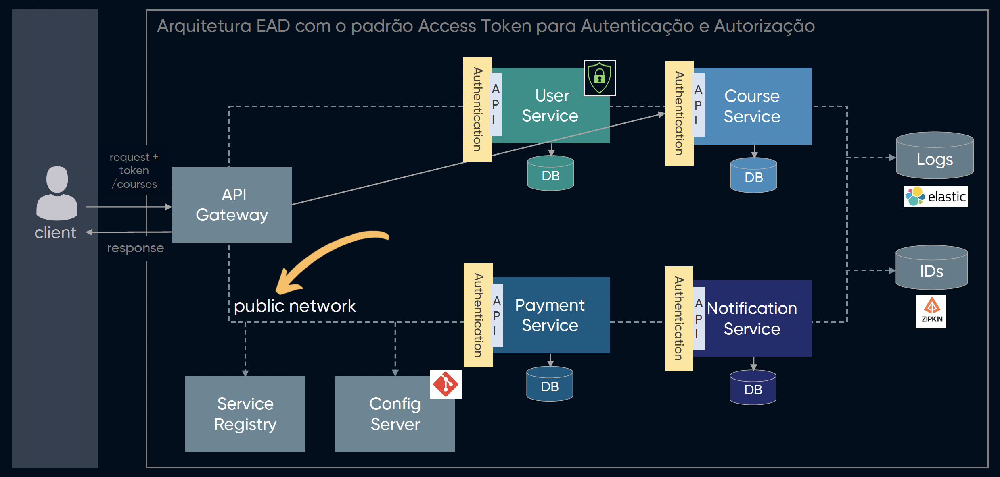

# PoC - Microsserviços em Java com Spring Boot

<!-- TOC -->
- [PoC - Microsserviços em Java com Spring Boot](#poc---microsserviços-em-java-com-spring-boot)
- [Contexto](#contexto)
- [Arquitetura](#arquitetura)
<!-- TOC -->

# Contexto

Nesta PoC vamos abordar a criação de um Sistema EAD, onde vamos aplicar alguns design patterns de Microsserviços utilizando Spring Boot.

# Arquitetura

A principio vamos criar 4 Microsserviços sendo eles (**User Service**, ***Course Service**, **Payment Service** e **Notification Service**), como mostrado na imagem abaixo:

